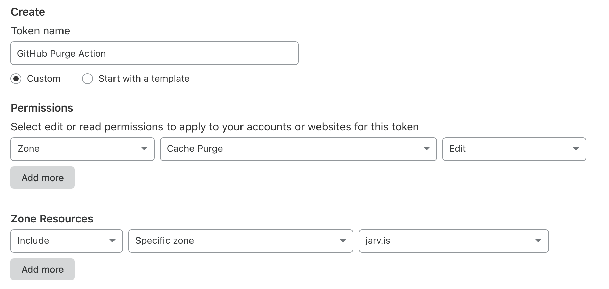

# Cloudflare Purge Action

This simple action calls the [Cloudflare API](https://api.cloudflare.com/#zone-purge-all-files) to purge the cache of your website.

## Usage

All sensitive variables should be [set as encrypted secrets](https://help.github.com/en/articles/virtual-environments-for-github-actions#creating-and-using-secrets-encrypted-variables) in the action's configuration.

### Configuration Variables

| Key | Value | Suggested Type | Required |
| ------------- | ------------- | ------------- | ------------- |
| `CLOUDFLARE_ZONE` | **Required for both methods below.** The Zone ID of your domain, which can be found in the right sidebar of your domain's overview page on the Cloudflare dashboard. For example, `xyz321xyz321xyz321xyz321xyz321xy`. | `secret` | **Yes** |
| `PURGE_URLS` | **Optional.** An array of **fully qualified URLs** to purge. For example: `["https://example.com/style.css", "https://example.com/favicon.ico"]`. If unset, the action will purge everything (which is suggested — [more info below](#purging-specific-files)). | `env` | No |

### Authentication Variables

Both authentication methods below require you to grab information from the [API Tokens page in the dashboard](https://dash.cloudflare.com/profile/api-tokens). Details on the inner workings of each method can be found [in Cloudflare's API docs](https://api.cloudflare.com/#getting-started-requests).

#### Option 1: Restricted API Token

API Tokens are [a new feature](https://blog.cloudflare.com/api-tokens-general-availability/) as of August 2019. They allow you to restrict the scope of this action to only purging the cache of zones you specify. In other words, this is much safer than allowing this action complete control of your entire Cloudflare account.

| Key | Value | Type |
| ------------- | ------------- | ------------- |
| `CLOUDFLARE_TOKEN` | The restricted API Token with permissions to purge the cache of one or more zones. | `secret` |

Creating a token can be tricky, so here's what you should enter [on this page](https://dash.cloudflare.com/profile/api-tokens) to create a token for purging the cache of a single domain on your account:



#### Option 2: Global API Key

This is the "traditional" method of authenticating — simply grab your "Global API Key" from [the dashboard](https://dash.cloudflare.com/profile/api-tokens). Using this method also **requires a second environment variable** with the email address linked to your account.

| Key | Value | Type |
| ------------- | ------------- | ------------- |
| `CLOUDFLARE_EMAIL` | The email address you registered your Cloudflare account with. For example, `me@example.com`. | `secret` |
| `CLOUDFLARE_KEY` | Your Cloudflare API key, which can be generated using [these instructions](https://support.cloudflare.com/hc/en-us/articles/200167836-Where-do-I-find-my-Cloudflare-API-key-). | `secret` |

### GitHub Actions

```yaml
name: Deploy my website
on: push

jobs:
  deploy:
    runs-on: ubuntu-latest
    steps:

    # Put steps here to build your site, deploy it to a service, etc.

    - name: Purge cache
      uses: docker://toumoro/cloudflare-purge-action:latest
      env:
        # Zone is required by both authentication methods
        CLOUDFLARE_ZONE: ${{ secrets.CLOUDFLARE_ZONE }}

        CLOUDFLARE_TOKEN: ${{ secrets.CLOUDFLARE_TOKEN }}
        # ...or:
        CLOUDFLARE_EMAIL: ${{ secrets.CLOUDFLARE_EMAIL }}
        CLOUDFLARE_KEY: ${{ secrets.CLOUDFLARE_KEY }}
```

### GitLab CI

```yaml
stage:
  ...
  - flush_cache

...

flush_cache:
  image: toumoro/cloudflare-purge-action:latest
  script: [ 'true' ]
  variables:
    # Zone is required by both authentication methods
    CLOUDFLARE_ZONE: $CLOUDFLARE_ZONE

    CLOUDFLARE_TOKEN: $CLOUDFLARE_TOKEN
    # ...or:
    CLOUDFLARE_EMAIL: $CLOUDFLARE_EMAIL
    CLOUDFLARE_KEY: $CLOUDFLARE_KEY
```

### Bitbucket Pipeline

```yaml
pipelines:
  default:
    ...
    - step:
      name: Flush Cloudflare Cache
      script:
        - *auto_devops
        - set_environment_variable
        - pipe: docker://toumoro/cloudflare-purge-action:latest
          variables:
            # Zone is required by both authentication methods
            CLOUDFLARE_ZONE: $CLOUDFLARE_ZONE

            CLOUDFLARE_TOKEN: $CLOUDFLARE_TOKEN
            # ...or:
            CLOUDFLARE_EMAIL: $CLOUDFLARE_EMAIL
            CLOUDFLARE_KEY: $CLOUDFLARE_KEY
```

### Purging specific files

To purge only specific files, you can pass an array of **fully qualified URLs** via a fourth environment variable named `PURGE_URLS`. Unfortunately, Cloudflare doesn't support wildcards (unless you're on the insanely expensive Enterprise plan) so in order to purge a folder, you'd need to list every file in that folder. It's probably safer to leave this out and purge everything, but in case you want really to, the syntax is as follows:

```yaml
PURGE_URLS: '["https://example.com/style.css", "https://example.com/favicon.ico"]'
```

## License

This project is distributed under the [MIT license](LICENSE).
